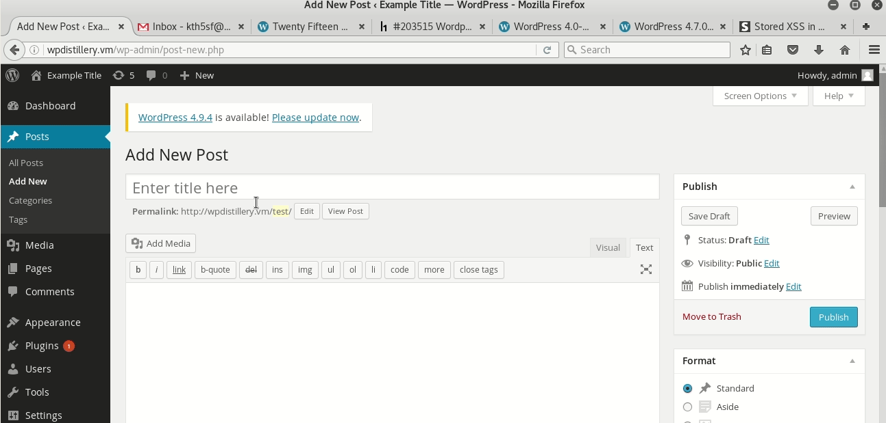
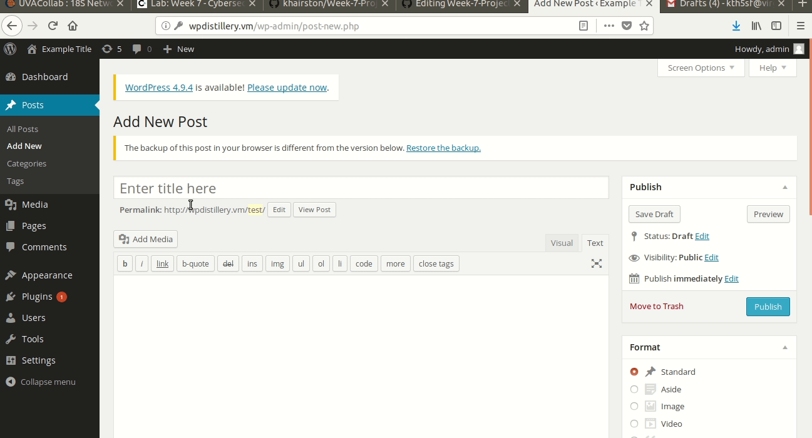
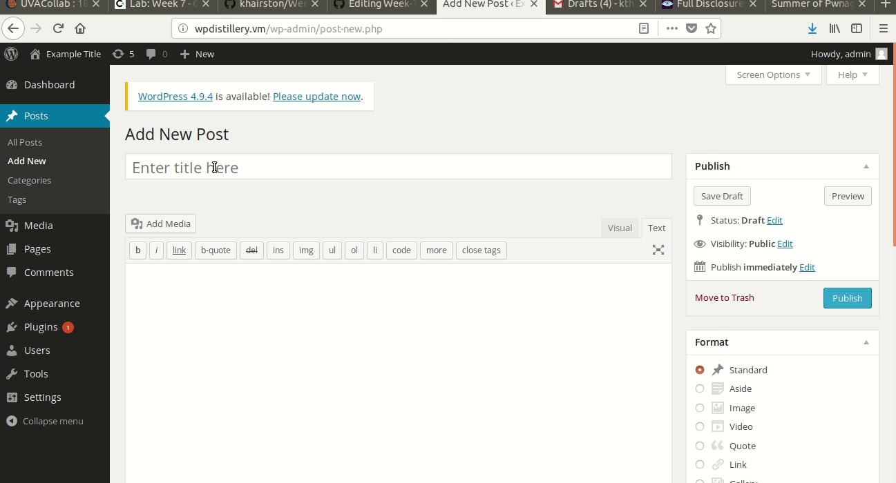

# Project 7 - WordPress Pentesting

Time spent: **8** hours spent in total

> Objective: Find, analyze, recreate, and document **five vulnerabilities** affecting an old version of WordPress

## Pentesting Report

1. (Required) XSS
  - [ ] Summary: This vulnerability allows those with editing priviliges to XSS. It was fixed in WP version 4.2.3
    - Vulnerability types: Authenticated Stored Cross-Site Scripting 
    - Tested in version: 4.2.2
    - Fixed in version: 4.2.3
  - [ ] GIF Walkthrough: 
  - [ ] Steps to recreate: Change WP version to 4.2.2 or lower. Then create a post and type " <a href="[caption code=">]</a><a title=" onmouseover=alert('test')  ">link</a> " into the text box. Preview to check results.
  - [ ] Affected source code: No source code affected; linked is the blog describing the vulnerability.
    - [Link 1](https://klikki.fi/adv/wordpress3.html)
1. (Required) XSS
  - [ ] Summary: This vulnerability allows those with editing access to insert a payload into the textbox. It is executed when the preview button is pressed. This was fixed in version 4.8.2
    - Vulnerability types: Stored Cross-Site Scripting
    - Tested in version: 4.2.2
    - Fixed in version: 4.8.2
  - [ ] GIF Walkthrough:  
  - [ ] Steps to recreate: Change WP version to 4.8.1 or lower. Then create a post and type "  " Preview to check the results,
  - [ ] Affected source code: No source code affected; linked is the blog describing the vulnerability.
    - [Link 1](https://blog.sucuri.net/2017/09/stored-cross-site-scripting-vulnerability-in-wordpress-4-8-1.html)
1. (Required)  XSS
  - [ ] Summary: This vulnerability allows those with editing privileges to upload an image file that contains malicious javascript. This was fixed in version 4.6.1
    - Vulnerability types:  Authenticated Stored Cross-Site Scripting via Image Filename
    - Tested in version: 4.2.2
    - Fixed in version: 4.6.1
  - [ ] GIF Walkthrough:  
  - [ ] Steps to recreate: Change WP version to 4.6 or lower. Then create a post and type " xsstest.jpg " into the text box. Post and view the post. You will see that the image file is the same name as the post name. 
  - [ ] Affected source code: No source code affected; linked is the blog describing the vulnerability.
    - [Link 1](https://sumofpwn.nl/advisory/2016/persistent_cross_site_scripting_vulnerability_in_wordpress_due_to_unsafe_processing_of_file_names.html)
1. (Optional) User Enumeration
  - [ ] Summary: 
    - Vulnerability types:
    - Tested in version:
    - Fixed in version: 
  - [ ] GIF Walkthrough: 
  - [ ] Steps to recreate: 
  - [ ] Affected source code:
    - [Link 1](https://core.trac.wordpress.org/browser/tags/version/src/source_file.php)
1. (Optional) Privilege Escalation
  - [ ] Summary: 
    - Vulnerability types:
    - Tested in version:
    - Fixed in version: 
  - [ ] GIF Walkthrough: 
  - [ ] Steps to recreate: 
  - [ ] Affected source code:
    - [Link 1](https://core.trac.wordpress.org/browser/tags/version/src/source_file.php) 

## Assets

List any additional assets, such as scripts or files

## Resources

- [WordPress Source Browser](https://core.trac.wordpress.org/browser/)
- [WordPress Developer Reference](https://developer.wordpress.org/reference/)

GIFs created with [Peek](https://github.com/phw/peek).

## Notes

I had issues with permalinks, but that issue was fixed by saving changes in wp-admin. 
Also had issues with accessing the wpdistillery.vm links initially, but that issue was fixed by deleting setup files and restarting the process

## License

    Copyright [2018] [Katelyn Hairston]

    Licensed under the Apache License, Version 2.0 (the "License");
    you may not use this file except in compliance with the License.
    You may obtain a copy of the License at

        http://www.apache.org/licenses/LICENSE-2.0

    Unless required by applicable law or agreed to in writing, software
    distributed under the License is distributed on an "AS IS" BASIS,
    WITHOUT WARRANTIES OR CONDITIONS OF ANY KIND, either express or implied.
    See the License for the specific language governing permissions and
    limitations under the License.
